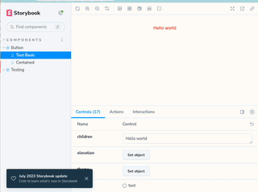
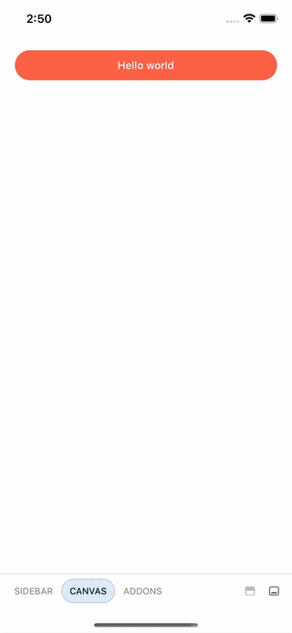
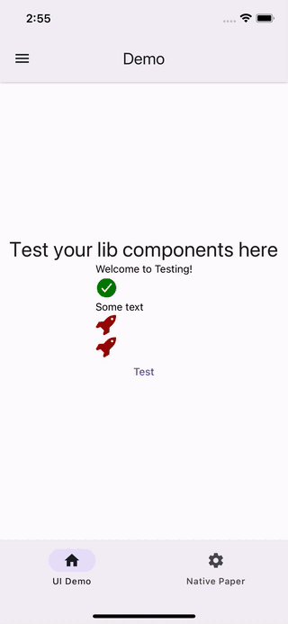

# UI Lib Starter Kit

shared ui library starter kit for native and web compatibility

The library integrate react native paper and react native web to provide a seamless experience on both platform.

## Installation

```sh
yarn
yarn bootstrap
```
## Usage

This repo comes with multiple ways to validate the components

- storybook web
```sh
# Check your stories with storybook (best to validate on web)
yarn storybook

```


-  storybook on device
```sh
# or on device
yarn storybook:device
```


- example app
```sh
cd example
yarn start
```



Feel free to modify the example app to test the full flow on device.
